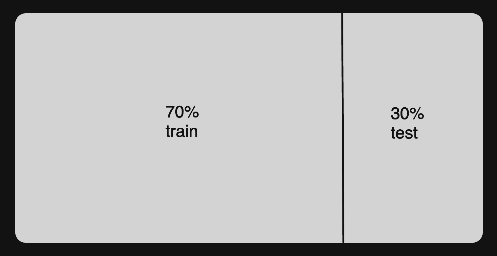

# Introducción a Scikit-Learn

**Puedes usar un cuaderno de Python para ejecutar los ejemplos de este cuaderno**

## ¿Qué es Scikit-Learn?

Scikit-Learn es una biblioteca de Python ampliamente utilizada para el aprendizaje automático (Machine Learning). Proporciona herramientas simples y eficientes para la minería de datos y el análisis de datos. Scikit-Learn se basa en otras bibliotecas de Python como NumPy, SciPy y Matplotlib, y es conocida por su facilidad de uso y su extensa colección de algoritmos de aprendizaje automático.

## ¿Cuándo se Usa Scikit-Learn?

Scikit-Learn se utiliza para una variedad de tareas de aprendizaje automático, incluyendo:

- **Clasificación**: Identificación de la categoría a la que pertenece un dato.
- **Regresión**: Predicción de un valor continuo.
- **Clustering**: Agrupamiento de datos en grupos similares.
- **Reducción de Dimensionalidad**: Reducción del número de variables en los datos.
- **Selección de Modelos**: Comparación, validación y selección de parámetros y modelos.
- **Preprocesamiento de Datos**: Transformación de datos para mejorar el rendimiento del modelo.

## Ejemplos de Código con Scikit-Learn

### Instalación

Para instalar Scikit-Learn, puedes usar pip:

```bash
pip install scikit-learn
```

### Importar la Librería

```python
import sklearn
```

### Clasificación: Ejemplo con el Dataset de Iris

1. **Importar Librerías y Dataset**

```python
import numpy as np
import matplotlib.pyplot as plt
from sklearn import datasets
from sklearn.model_selection import train_test_split
from sklearn.preprocessing import StandardScaler
from sklearn.neighbors import KNeighborsClassifier
from sklearn.metrics import accuracy_score
```

2. **Cargar el Dataset de Iris**

```python
# Cargar el dataset de Iris
iris = datasets.load_iris()
X = iris.data
y = iris.target
```

3. **Dividir el Dataset en Conjuntos de Entrenamiento y Prueba**



- Se separan datos de entrenamiento (train) y de prueba (test) para que una parte no influya a la otra. 
- Se hace de forma aleatoria para que no haya sesgo. 
- La parte recomendada de test es alrededor del `30%`.

```python
# Dividir los datos en conjuntos de entrenamiento y prueba
X_train, X_test, y_train, y_test = train_test_split(X, y, test_size=0.3, random_state=42)
```

4. **Estandarizar los Datos**

```python
# Estandarizar las características
scaler = StandardScaler()
X_train = scaler.fit_transform(X_train)
X_test = scaler.transform(X_test)
```

5. **Entrenar un Modelo de Clasificación (K-Nearest Neighbors)**

```python
# Entrenar el modelo K-Nearest Neighbors
knn = KNeighborsClassifier(n_neighbors=3)
knn.fit(X_train, y_train)
```

6. **Hacer Predicciones y Evaluar el Modelo**

```python
# Hacer predicciones
y_pred = knn.predict(X_test)

# Evaluar el modelo
accuracy = accuracy_score(y_test, y_pred)
print(f'Accuracy: {accuracy:.2f}')
```

### Regresión: Ejemplo con el Dataset de Boston

1. **Importar Librerías y Dataset**

```python
from sklearn import datasets
from sklearn.model_selection import train_test_split
from sklearn.linear_model import LinearRegression
from sklearn.metrics import mean_squared_error
```

2. **Cargar el Dataset de Boston**

```python
# Cargar el dataset de Boston
boston = datasets.load_boston()
X = boston.data
y = boston.target
```

3. **Dividir el Dataset en Conjuntos de Entrenamiento y Prueba**

```python
# Dividir los datos en conjuntos de entrenamiento y prueba
X_train, X_test, y_train, y_test = train_test_split(X, y, test_size=0.3, random_state=42)
```

4. **Entrenar un Modelo de Regresión Lineal**

```python
# Entrenar el modelo de regresión lineal
reg = LinearRegression()
reg.fit(X_train, y_train)
```

5. **Hacer Predicciones y Evaluar el Modelo**

```python
# Hacer predicciones
y_pred = reg.predict(X_test)

# Evaluar el modelo
mse = mean_squared_error(y_test, y_pred)
print(f'Mean Squared Error: {mse:.2f}')
```

### Clustering: Ejemplo con K-Means

1. **Importar Librerías y Dataset**

```python
from sklearn import datasets
from sklearn.cluster import KMeans
import matplotlib.pyplot as plt
```

2. **Cargar el Dataset de Iris**

```python
# Cargar el dataset de Iris
iris = datasets.load_iris()
X = iris.data
```

3. **Aplicar K-Means para Agrupar los Datos**

```python
# Aplicar K-Means
kmeans = KMeans(n_clusters=3, random_state=42)
kmeans.fit(X)

# Obtener las etiquetas de los clusters
labels = kmeans.labels_
```

4. **Visualizar los Clusters**

```python
# Visualizar los clusters
plt.scatter(X[:, 0], X[:, 1], c=labels, cmap='viridis')
plt.xlabel('Sepal Length')
plt.ylabel('Sepal Width')
plt.title('Clusters de Iris con K-Means')
plt.show()
```

## Conclusión

Scikit-Learn es una herramienta poderosa y versátil para el aprendizaje automático en Python. Con su amplia gama de algoritmos y herramientas, puedes abordar una variedad de problemas de Machine Learning, desde la clasificación y regresión hasta el clustering y la reducción de dimensionalidad. Scikit-Learn facilita el proceso de construir y evaluar modelos de Machine Learning, haciendo que sea accesible tanto para principiantes como para expertos.